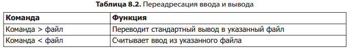
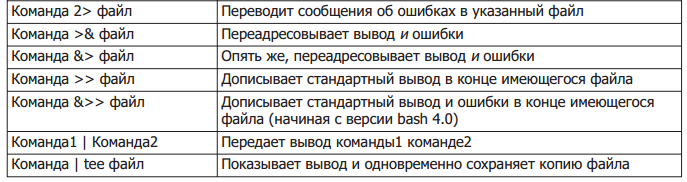

<http://tldp.org/LDP/Bash-Beginners-Guide/html/index.html>

<http://www.opennet.ru/docs/RUS/bash_scripting_guide/>

```
#!/bin/bash
# полезные при отладке и для безопасности настройки
set -euo pipefail
trap "echo 'error: Script failed: see failed command above'" ERR
# ... скрипт
exit 0
```

### Quiotes
* `"..."` - отменяет интерпретацию, но подстановки разворачиваются
* `'...'` - еще более строго, подстановки не разворачиваются
* `\'` - экранирование кавычки
* ``` `...` ``` - выполнить команду внутри скобок и заменить скобки возвращенным значением

### Parameters

 `$1...$9` | аргументы
 `$#` | кол-во аргументов
 `$0` | имя команды
 `$@` | все параметры
 `shift` | сдвиг параметров влево

### Global vars

 `$$` | PID текущего процесса
 `$?` | код возврата последней команды

### IF
```sh
if [ "$1" = hi ]; then
...
else
...  
fi

if [ ... ]; then
elif [ ...]   then
fi

if [...] && [ ... ]; then ... fi
[ ... ] && <cmd>

[ -f "file1" -a "file2" ]  
```

#### Операторы проверки

Выражение в [] должно возвращать `0` (это true) или не-`0` (это false)

* `-f/-d/-e` - файл/директория/файл либо директория существует
* `-n/-z` - строка непустая/пустая
* `=/!=` - сравнение строк
* `-eq/-ne` - равно/неравно
* `-gt/-ge/-lt/-le` - больше/больше-равно/меньше/меньше-равно
* `=~` - соответствие регекспу `[[ $date =~ ^[0-9]{4}$ ]] && echo 'yes'`

### Loop
```bash
while [ ... ]; do

done  

for arg in "arg1" "arg2"; do
  ...
done

#итерация по файлам
for file in *.log
do
  echo "$file"
done
# или более тонко
for file in "$( find $directory -name '*.log' )"
do
  echo "$file"
done

# по-умолчанию цикл проходит по $@
for arg
do
  ...
done

# классический стиль for
# Двойные круглые скобки и "LIMIT" без "$".
LIMIT=10
for ((a=1; a <= LIMIT ; a++))  
do
  echo -n "$a "
done  
```

#### Управление выходом

* `continue` - переход в начало текущего цикла
* `continue 2` - переход в начало цикла выше уровнем
* `break` - досрочный выход на предыдущий уровень вложенности
* `break 2` - досрочный выход на 2 уровня вложенности

### Switch-Case
```bash
case "$1" in
  start)
    start
    ;;
  stop)
    stop
    ;;
  *)
    echo "Wrong command"
    return 1
esac

# В case могут быть регулярки, шаблоны
case "$Keypress" in
  "$1"   ) echo "образец найден!";;
  [A-Z] | "!"  ) echo "Буква в верхнем регистре";;
esac  
```


### Подстановка
> см `man readline`

``cmd`` | выполнить команду и заменить на месте возвращенным рез-м
`$(cmd)` | аналогично предыдущему
`$[3+4]` | арифметика

[Работа со строками](bash_strings_processing.html)

### IO

`. <script file>` | импортировать команды из др файла и выполнить
`exec <command> ` | замещает оболочку другим процессом, при этом текущий сценарий заканчивается
`( <cmd1>; <cmd2> )` | выполнить команды в подоболочке
`nohup <cmd> > log.txt 2>&1 &` | запуск в бэкграунде с отвязкой от терминала

#### read

`read <var1> <var2>` - прочитать с stdin в переменную
* `\` - перевод строки при вводе
* `-n <num>` - автозавершение ввода при вводе указан. кол-ва символов
* `-p <prompt>` - вывод prompt
Пример
: `read -n1 -p "введите ключ команды: " COMMAND_KEY`

Чтение по строкам из stdin (csv-файл)
```sh
OIFS=$IFS; IFS=,
while read name family salary rest_of_columns
do
  echo "$family $name - $salary"
done </home/manager/workers.csv
IFS=$OIFS   
```


#### here-doc
```sh
# pipe into file
cat << EOF > file.txt
...
EOF
# pipe into command stdin
cat << EOF | sort
...
EOF
```





### Procedures
```bash
start()
{
  echo -n "$@"
  return
}
restart()
{
  stop
  start "message1" "message2"
}
```

### Arrays
<http://www.opennet.ru/docs/RUS/bash_scripting_guide/c12790.html>  
```sh
declare -a ARR=()
#or
ARR=( [0]="elem1" [2]="elem2" )
ARR=( elem1 elem2 )
#or
ARR[0]="smth"

#get element
echo ${ARR[2]};
#length
echo ${#ARR[*]}

#iteration
for i in "${colors[@]}"
do
  echo "$i"
done

#manipulating
# push
array0=( "${array0[@]}" "новый1" )
# delete
unset array0[2]
# subarray
declare -a array3=( ${array0[@]:1:2} )

# загрузка из файла (по одному слову в строке)
declare -a array1
array1=( `cat "$filename" | tr '\n' ' '`)
echo ${array1[@]}
```

### jobs
* `wait` - ждет, пока завершит работу запущенные ранее фоновые процессы
* `wait <PID/job code>` - ждет, пока завершит работу указанный процесс/джоб
* `kill` - передача сигнала
* `$!` - PID последнего фонового процесса
* `jobs`  - список заданий. `fg, bg` - перевод указанных (или текущийх) заданий на передний план/фон
* `Ctrl+Z` - приостановка текущего задания на переднем плане (после этого может быть убрано в фон вызовом `bg`)
