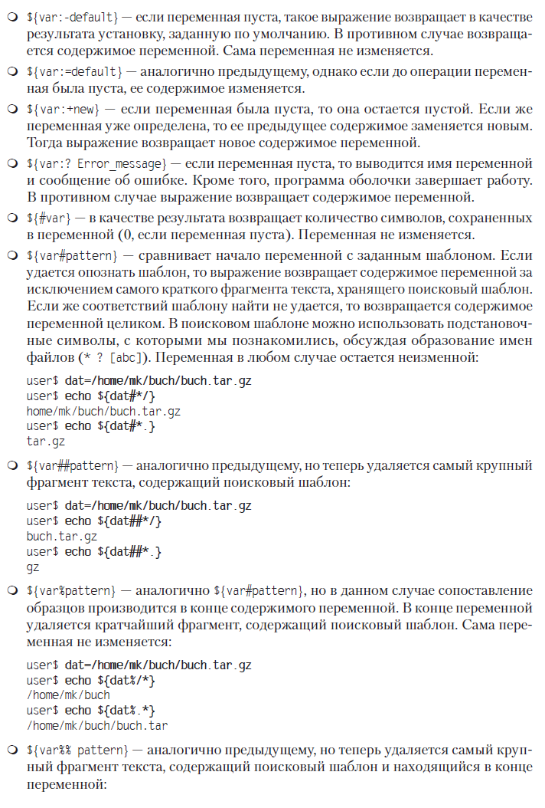
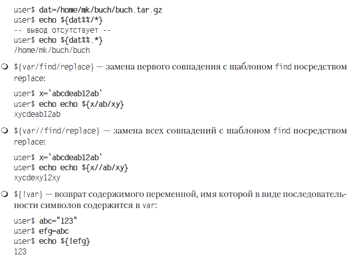

# Разбор строковых переменных
Англ: 'Manipulating and/or expanding variables'
* `${var:pos}` - подстрока начиная с позиции __pos__
* `${var:pos:length}` - подстрока длиной __length__ с позиции __pos__

# Поиск по строкам
## grep
Поддерживает сложные регекспы с флагом -E

<https://gist.github.com/bbrother92/64c22b8be8221b45709ae1c03cd25028>

Special symbols: `. ^ $ * + - ? ( ) [ ] { } \ |`
