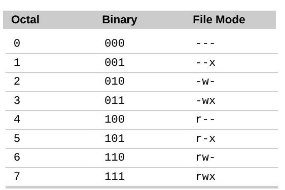

## User management

```bash
#add/delete group
groupadd group1
groupdel group1

#add user
adduser <username>

adduser <username> <group>
# -g gr1 - main group
# -G gr1,gr2 - add to secondary groups
adduser -M -n <username> # without home dir and private group

#delete user
userdel -r <user> #delete user and home directory

#change main group of user
usermod -g <group> <user>
#add user to secondary group
adduser <user> <group>
usermod -a -G <group> <user>

#display user group
id <user>
groups <user>

#display groups
less /etc/group
#display users
less /etc/passwd
```

## Access management
```bash
#change group of owner of file
chgrp <group> <file>
chown <user>:<group> <file>
```

### chmod
```bash
chmod u=rwx,g=rx,o=r myfile
chmod 754 myfile
chmod -r 766 dir
```

